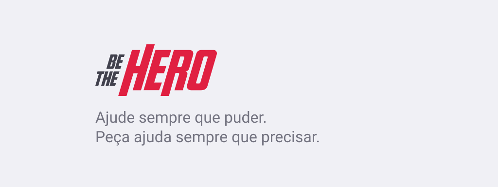

<p align="center">
  
</p>

<br />

## 🚀 Tecnologias utilizadas no projeto

<br />

```bash
- Todo o projeto foi desenvolvido utilizando TypeScript
```

```bash
# No Backend

- Node.js
- Express
- Knex.js
- SQLite3
```

```bash
# Na Plataforma Web

- React
- React Router DOM
- Axios
- React Icons
- Vite
```

```bash
# No Aplicativo

- React Native
- React Navigation
- Axios
- Expo
```
